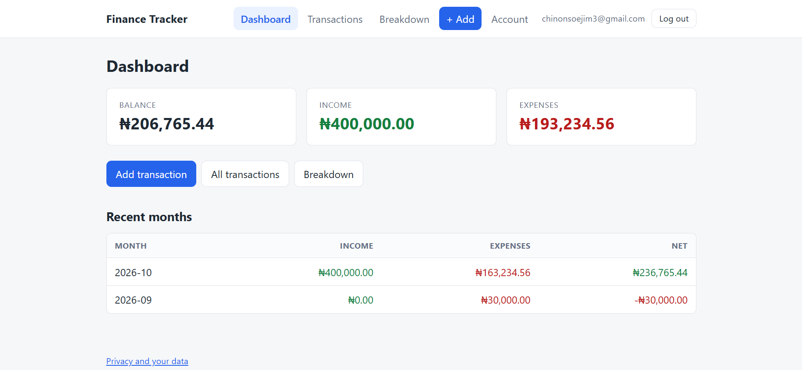
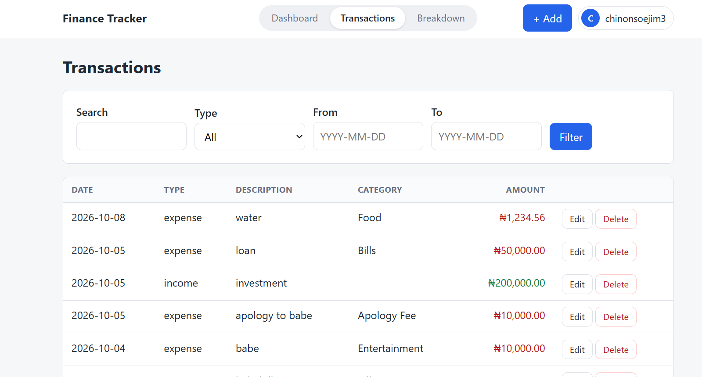
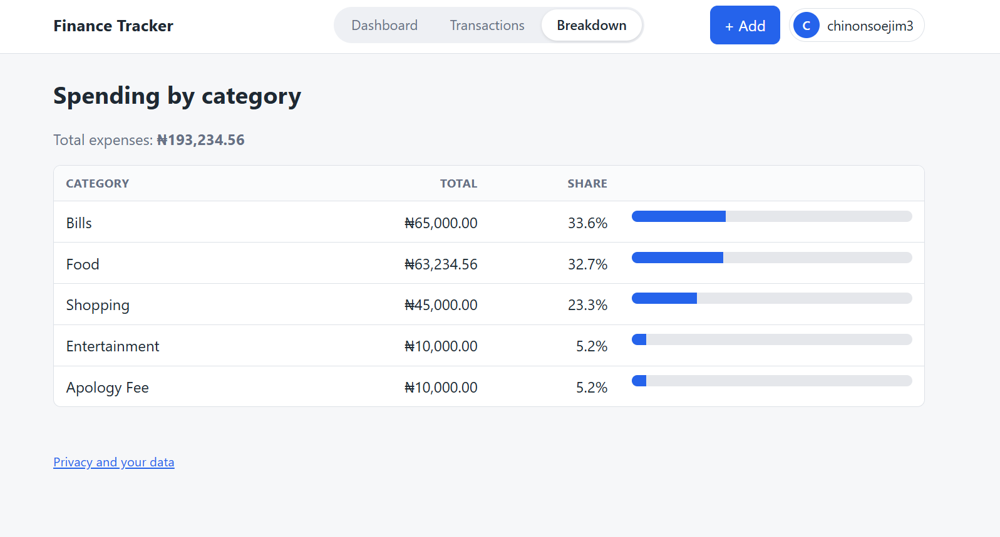
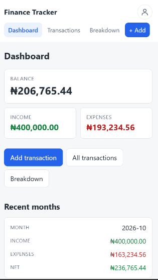

# Finance Tracker

A multi-user personal finance tracker in Python. It started as a ten-line command-line script and was grown, one tested step at a time, into a Flask web app with accounts, per-user data isolation and a security layer. It answers one question: **where did my money go?**

> **Demo project.** This is a learning project, not a commercial service. Use made-up data and never enter account numbers or card details. See the in-app privacy page for details.

## Screenshots

| Dashboard | Transactions | Breakdown | Phone |
|---|---|---|---|
|  |  |  |  |

## Features

- Register, log in and log out, with every transaction private to its owner
- Add, edit and delete income and expenses, with categories and dates
- Search and filter by keyword, type, and date range
- Dashboard with balance, income, expenses and a monthly summary
- Spending breakdown by category, with percentages and bars
- Export your data as CSV, and delete your account and all its data
- Money stored as integer kobo, so totals are exact
- Responsive layout that works on phones
- The original command-line interface still works (it asks you to log in)

## Run it

```
pip install -r requirements.txt
```

Web app (PowerShell):

```
$env:SECRET_KEY = python -c "import secrets; print(secrets.token_hex(32))"
python -m flask --app app:create_app run --debug
```

Then open http://127.0.0.1:5000 and create an account. Data is stored in `finance.db`, which is created on first run and is not part of the repository.

Command line (log in with an account made in the web app):

```
python main.py
```

## Tests

```
python -m pytest -q
```

286 automated tests cover calculations, validation, the database layer, every web route, authentication, CSRF, rate limiting, CSV export, account deletion and a two-user isolation suite.

## Architecture

| File | Job |
|---|---|
| `app.py` | Flask routes, sessions, CSRF, error pages, security headers |
| `wsgi.py` | production entry point (gunicorn) |
| `users.py` | accounts, password hashing, validation |
| `ratelimit.py` | failed-login tracking |
| `database.py` | SQLite access; every query is scoped by `user_id` |
| `models.py` | `Transaction` dataclass that validates itself |
| `money.py` | naira text to integer kobo and back |
| `calculations.py` | pure maths: totals, averages, categories, months |
| `filters.py` | pure filtering |
| `export.py` | CSV export |
| `backup.py` | consistent database backups |
| `main.py`, `tracker.py`, `input_helpers.py` | command-line interface |
| `templates/`, `static/` | pages and stylesheet |
| `tests/` | the test suite |

The key design rule: calculation, filtering and storage code never prints or asks for input, so the CLI and the web app share the same tested logic.

## Security decisions

- **Passwords** are salted and hashed (werkzeug); the plain password is never stored or logged
- **Login errors are generic**, and unknown emails take similar time to wrong passwords
- **Data isolation:** every query filters by the logged-in user. Another user's record behaves exactly like a missing one (404). Tests prove user B cannot read, edit or delete user A's data
- **CSRF tokens** on every POST form, with a test that fails if a form lacks one
- **Login rate limiting:** 5 failures in 15 minutes locks an email or an IP
- **Secrets from the environment:** the app refuses to start in production without `SECRET_KEY`
- **Cookies:** HttpOnly, SameSite=Lax, Secure in production
- **Security headers:** nosniff, frame denial, same-origin referrer
- **CSV export** neutralises spreadsheet formulas
- **Destructive actions** (account deletion) require the password again and run in one database transaction

## Known limitations

- No email verification or password reset
- No Content-Security-Policy yet (the pages use small inline attributes)
- SQLite needs a persistent disk if deployed; the app has not been publicly deployed
- Floats were avoided for money, but there is no multi-currency support

## What I learned

- Splitting input, logic, display and storage so each can be tested alone
- Refactoring in small steps with tests as a safety net
- Replacing loose dictionaries with a validated class
- Parameterised SQL, commits, and database ids versus list positions
- Representing money exactly, and migrating real data safely with backups
- Authentication versus authorisation, and testing isolation with two accounts
- CSRF, rate limiting, secure cookies and environment-based secrets
- Using Git branches, tags, and a `.gitignore` that keeps personal data out of the repository

## History

Early versions stored data in a JSON file. That code was removed after the move to SQLite and remains in the Git history.